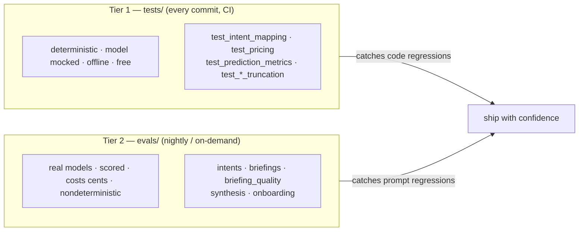
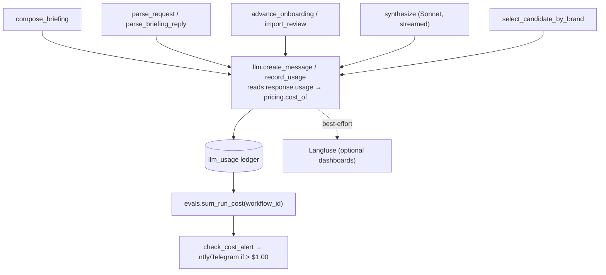
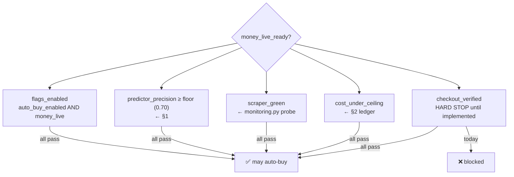

# Evals & observability

How grocery-buddy proves it works — prediction accuracy, LLM-output quality, and
per-run cost — and how those signals gate the (future) money-live switch.

> Companion to [SYSTEM_REFERENCE.md](SYSTEM_REFERENCE.md) and
> [ARCHITECTURE.md](ARCHITECTURE.md). This layer was rebuilt in June 2026 — see
> "What this replaced" at the bottom for the bugs it fixed.

---

## TL;DR

| Question | Where it's answered | Gating? |
|---|---|---|
| Did the **predictor** flag the right items? | `evals.py` ← `prediction_snapshots` table | precision/recall |
| Is the **intent router** mapping messages correctly? | `tests/test_intent_mapping.py` (code) + `evals/` suite `intents` (prompt) | yes |
| Are **briefings / synthesis / onboarding** outputs good? | `evals/` suites | yes |
| What did a run **cost**? | `llm_usage` ledger ← every call via `grocery_buddy.llm` | cost alert |
| Is it **safe to spend real money**? | `gating.py::money_live_ready` (reads all of the above) | hard gate |

```
grocery-buddy eval surface
├── tests/         deterministic, mocked, offline   → runs every commit (CI)
├── evals/         real-model, scored, nightly       → prompt-regression safety
├── evals.py       predictor precision/recall        → from prediction snapshots
├── llm_usage      per-call cost ledger              → makes the cost alert real
└── gating.py      money-live readiness gate         → evals decide if money is safe
```

---

## The two tiers (and why they're separate)

The single most important design choice: **never put paid, nondeterministic model
calls in the per-commit test suite.** So evals split in two:



| | **Tier 1 — `tests/`** | **Tier 2 — `evals/`** |
|---|---|---|
| Runs | every commit (CI `ci.yml`) | nightly + on-demand (`evals-nightly.yml`) |
| Model | **mocked** (patched `llm.create_message`) | **real** Haiku/Sonnet |
| Determinism | exact | scored (thresholded) |
| Cost / speed | free, ms | cents, seconds |
| Catches | the action-dict *mapping*, metric math, cost math, truncation | *prompt* quality drift, routing accuracy, synthesis correctness |

A prompt edit can't break Tier 1 (it mocks the model) — that's exactly why Tier 2
exists. A model swap (Haiku 4.5 → next) is a Tier-2 regression check.

---

## 1. Prediction accuracy — snapshots, not cart-membership

The predictor decides what's low; we measure whether it was right by **snapshotting
its decision at run time** and comparing against what was actually purchased later.

```mermaid
sequenceDiagram
    participant W as GroceryRunWorkflow
    participant A as select_run_candidates_activity
    participant DB as prediction_snapshots
    participant E as evals.compute_prediction_accuracy
    W->>A: predict (classify every pantry item)
    A->>DB: snapshot {product, flagged_low, days_remaining, ...} for ALL items
    Note over DB: one row per run (upsert by workflow_id)
    Note over W,DB: ... days pass; user buys things ...
    E->>DB: snapshots in last `eval_lookback_days`
    E->>E: for each snapshot, purchases within `eval_horizon_days`
    E->>E: precision = flagged∩bought / flagged<br/>recall = flagged∩bought / bought
```

For one snapshot (`evals.prediction_metrics`, pure + unit-tested):

```
predicted = { items the predictor flagged low }      ← from the snapshot
relevant  = { items actually purchased in horizon }  ← carts.status = 'purchased'

precision = |predicted ∩ relevant| / |predicted|     "of what we flagged, how much got bought"
recall    = |predicted ∩ relevant| / |relevant|       "of what got bought, how much we flagged"
```

Micro-averaged across all snapshots in the window. **Why recall is now honest:**
`predicted` comes from the *snapshot* (the predictor's actual output), independent of
what lands in a cart — so buying something we never flagged drops recall below 1.0.
(The old metric defined "predicted" as cart-membership, which made `purchased ⊆
predicted` by construction → recall ≡ 1.0 always. See bottom.)

- **Table:** `prediction_snapshots` (migration 010), one row per run.
- **Write:** `tools/predictions.py::record_prediction_snapshot`, called in
  `select_run_candidates_activity`.
- **Score:** `evals.py::compute_prediction_accuracy` (config:
  `eval_lookback_days=14`, `eval_horizon_days=7`).

---

## 2. Cost telemetry — the ledger that makes the alert real

Every Anthropic call goes through `grocery_buddy.llm`, which reads `response.usage`,
prices it (`pricing.py`), and writes one row to the **`llm_usage` ledger**. A run's
cost is the sum of its rows; if it exceeds the threshold, the alert fires.



**Run attribution without threading:** activities that call the model wrap their body
in `with run_scope(activity.info().workflow_id, user_id)`. The contextvar propagates
into deep calls (even `compose_briefing` inside `send_briefing`), so every in-run call
is tagged with the run's `workflow_id`. `run_evals_activity` runs in the *same*
workflow, so `sum_run_cost(activity.info().workflow_id)` totals exactly that run.

- **Ledger:** `llm_usage` (migration 011) — tokens (incl. cache read/write) + USD.
- **Pricing:** `pricing.py::MODEL_PRICES` (list prices; each token bucket priced
  independently since Anthropic reports cache reads separately from `input_tokens`).
- **Observability:** `tracing.py` mirrors generations/scores to Langfuse **best-effort**
  (no-ops without keys or on SDK drift — the repo's Langfuse is v4/OTEL). The ledger is
  the authoritative cost record; Langfuse is optional dashboards.

---

## 3. Model-accuracy evals (`evals/`)

Real-model suites scoring the quality of each LLM surface. Run:

```bash
uv run python -m evals.run                  # all suites
uv run python -m evals.run --suite intents
uv run python -m evals.run --threshold 0.8  # exit 1 if a gating suite < 0.8 (nightly)
```

| Suite | Function under test | Scoring | Gating |
|---|---|---|---|
| `intents` | `parse_request` / `parse_briefing_reply` | exact action match | ✅ |
| `briefings` | `compose_briefing` | deterministic groundedness (total + item tokens + length) | ✅ |
| `briefing_quality` | `compose_briefing` | **LLM-as-judge** (`judges.py`) tone/groundedness | report-only |
| `synthesis` | `synthesize_grocery_history` | expected-product recall + one-off exclusion | ✅ |
| `onboarding` | onboarding prompt+tools (no DB) | extracted-product recall | ✅ |

Datasets are labeled `.jsonl` under `evals/datasets/` — extend them, they're the
prompt-regression net. The harness emits each suite's score to Langfuse and exits
non-zero under `--threshold` (so nightly fails loudly on a prompt regression). With no
`ANTHROPIC_API_KEY` it skips with exit 0, so PR CI is never blocked on secrets.

---

## 4. The money-live readiness gate

The autonomous-buy spine is built **sandbox-first but money-live-ready**: flipping it
live is a gated config flip, not a rewrite. `gating.py::money_live_ready(user_id)` is
the gate, and **its conditions are eval-layer outputs** — which is why the evals are
the prerequisite for ever spending real money.



`checkout_verified` is a deliberate **hard stop** until staged-cart execution
verification (cart == approved items, incl. the cart-clear fix) ships — a signed
mandate bounds *intent*, not *execution*, so we must verify what actually landed in
the cart before money moves. Inspect the gate any time:

```bash
grocery-buddy gate --user-id <uuid>
```

---

## 5. Scraper health monitor

The Amazon automation fails *silently* on UI churn (a renamed selector returns `[]`,
swallowed at warning). `monitoring.py::check_scraper_health` searches known staples
and asserts a price + ASIN still extract, paging you on regression — so churn surfaces
on first break, not after a week of empty runs. It's also a gate condition (§4).

```bash
grocery-buddy scraper-health          # ad-hoc; schedule it via cron / a Temporal schedule
```

---

## How to run everything

```bash
# Tier 1 — deterministic, offline (what CI runs every commit)
uv run ruff check src/ tests/ evals/
uv run pytest -q

# Predictor accuracy + real per-run cost for a user (reads snapshots + ledger)
grocery-buddy evals --user-id <uuid>

# Tier 2 — real-model prompt evals (needs ANTHROPIC_API_KEY)
uv run python -m evals.run --threshold 0.8

# Operational
grocery-buddy scraper-health
grocery-buddy gate --user-id <uuid>
```

CI: `.github/workflows/ci.yml` (ruff + pytest, every push/PR) and
`.github/workflows/evals-nightly.yml` (model evals, 07:00 UTC + manual).

---

## What this replaced (the bugs fixed)

The previous "eval layer" was broken, not just thin:

1. **Prediction metric was tautological** — `predicted` = "items in *any* cart" ⊇
   `purchased` = "items in a purchased cart", so **recall ≡ 1.0** always and
   "precision" was really cart-conversion rate. The predictor's real output was never
   read. → Fixed by snapshotting the predictor's decision (§1).
2. **`tracing.py` was dead code** — never imported; and it called the Langfuse **v2**
   API while the installed SDK is **v4** (so it would have errored anyway). → Rewritten
   as a defensive best-effort emitter; the `llm_usage` ledger is now the source of truth.
3. **Cost alert could never fire** — `run_cost_usd` was a hardcoded `0.0`. → Now summed
   from the real `llm_usage` ledger per run (§2).
4. **Zero evaluation of any LLM output**, no prompt-regression safety, and the only
   "e2e" test was the stock `npm create playwright` scaffold hitting `playwright.dev`.
   → Tiered tests + model-eval suites (§3, Tier 1/2).

## Gaps / roadmap

- Larger labeled datasets (the `.jsonl` files are seeds — grow them as real messages arrive).
- A second recall signal for §1 (ad-hoc QuickBuys / manual "we're out" corrections as
  additional "the predictor missed it" evidence; today recall is vs. confirmed purchases).
- Implement `checkout_verified` (cart == approved items) to unblock the money-live gate.
- Wire `scraper-health` to a Temporal schedule so it runs unattended.
