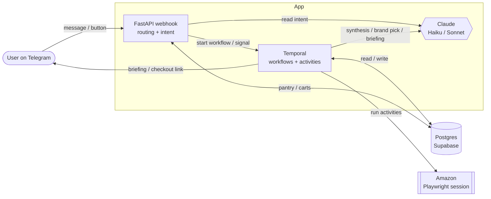
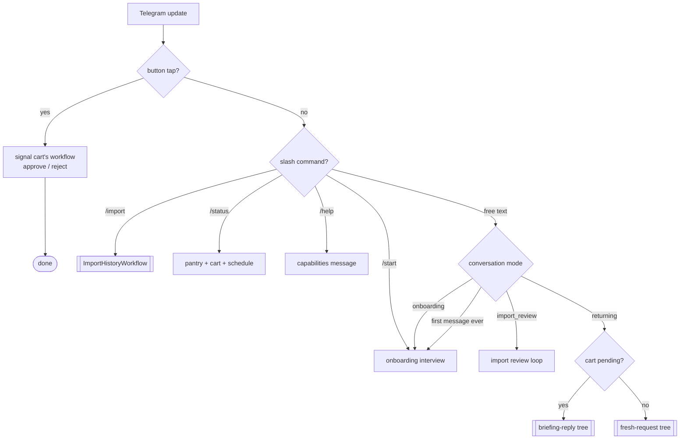
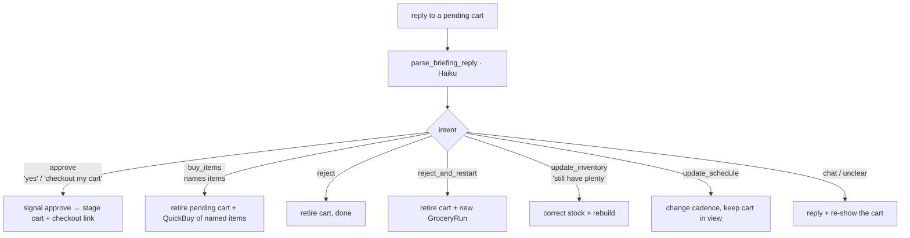
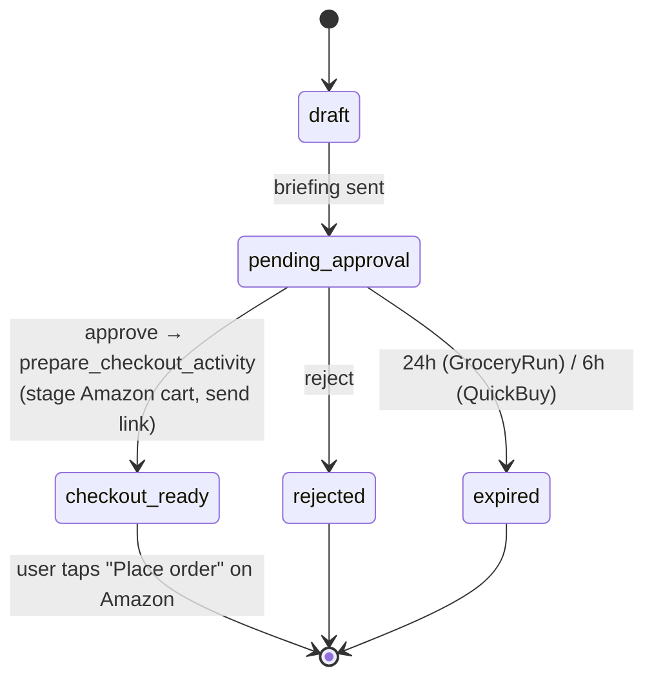
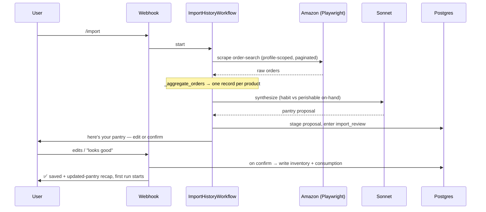

# System Reference

The canonical map of grocery-buddy: every model, agentic loop, deterministic
workflow, tool, data model, and decision tree, and how they fit together. If you
change behavior, update this file.

> Companion docs: [ARCHITECTURE.md](ARCHITECTURE.md) (why the stack is shaped this
> way), [DATABASE.md](DATABASE.md) (schema detail), [OPERATIONS.md](OPERATIONS.md),
> [SETUP.md](SETUP.md), [HOSTING.md](HOSTING.md).

---

## 1. Mental model

Two kinds of "brains" run the product, and they are deliberately separated:

| | **Agentic loops** (Claude) | **Deterministic workflows** (Temporal) |
|---|---|---|
| Owns | language → intent, synthesis, conversation | scheduling, retries, the approval timer, exactly-once money movement |
| Lives in | `agents/*.py`, one activity in `activities.py` | `workflows/*.py` |
| Failure mode | degrade to a fallback message / empty result | durable retry, survives crashes |
| When unsure | ask the user / default safely | never guess — replay deterministically |

The flow of control is always: **Telegram message → webhook decision tree → (Claude
loop to read intent) → start a Temporal workflow → (Temporal calls activities, some
of which call Claude) → notification back to Telegram.**

Two safety invariants hold everywhere:

1. **We never place an order.** The agent stages an Amazon cart and hands back a
   checkout link; the human taps "Place order."
2. **Nothing touches the live pantry or a cart without the user's say-so** — every
   purchase passes an approval gate, and the order-history import stages a proposal
   the user confirms before it's written.

---

## Visual map

### Components — who talks to whom


### Inbound message routing (the top-level decision tree)


### Reply when a cart is pending (least-friction rule)


### Cart approval lifecycle (GroceryRun / QuickBuy)


### Order-history import pipeline (`/import`)


---

## 2. Models (Claude)

Configured in `config.py`; two tiers.

| Setting | Default | Used for |
|---|---|---|
| `model_smart` | `claude-sonnet-4-6` | **Only** order-history synthesis (`synthesize_grocery_history`) — the one genuinely hard parse/reasoning step |
| `model_fast` | `claude-haiku-4-5` | Everything else: onboarding intake, import review, request parsing, briefing-reply parsing, briefing composition, brand selection |

Rule of thumb: Haiku for routing/extraction/chat; Sonnet only where messy
real-world data must become a clean structured proposal.

---

## 3. Agentic loops (Claude tool-use)

Six distinct LLM call-sites. "Loop" = re-prompts until no more tool calls;
"single-shot" = one call.

> **Shared voice:** the conversational prompts (3.3–3.6) all prefix a single
> `PERSONA` constant (`agents/assistant.py`) — "warm, concise Grocery Buddy; never
> interrogate for a qty/brand they didn't give; Telegram HTML only." Edit the voice
> in one place; don't restate those rules per prompt.

### 3.1 Onboarding intake — `agents/onboarding.py::advance_onboarding` *(loop, Haiku)*
Parses a free-form pantry dump ("12 eggs, milk weekly, paper towels") into saved
records. Loops on tool results until the turn is done.
Tools: `save_inventory_item`, `save_consumption_habit`, `import_amazon_orders`
(hands off to the import flow), `finish_onboarding`.
Writes directly to `inventory_items` / `consumption_profile`.

### 3.2 Import synthesis — `agents/order_history.py::synthesize_grocery_history` *(single-shot, Sonnet, `max_tokens=8192`)*
Turns scraped Amazon orders into a clean, de-duplicated recurring-pantry proposal.
Forced tool call: `propose_pantry`. Never raises — degrades to `[]`.

**Pre-aggregation (`_aggregate_orders`, pure Python) runs first:** raw orders are
collapsed into **one record per product** keyed by ASIN (title fallback), carrying
`times_ordered`, `total_units`, `first/last_ordered`, `days_since_last`, and recent
`order_dates`. This is essential, not cosmetic — sending 150 raw rows made the
forced tool call overflow `max_tokens` and return unparseable/empty results. The
model then makes **two separate judgments per product**:
1. *Include?* — repeat-staple vs one-off (keep groceries/consumables; drop clothing,
   bedding, electronics, one-time buys).
2. *Habit vs on-hand* — always learn the **habit** (`daily_rate`, `preferred_brand`,
   `unit`) even from old orders, but estimate **on-hand today** realistically:
   perishables past shelf life → `estimated_qty = 0` (nobody has 3-month-old milk);
   non-perishables deplete from the last order by rate × `days_since_last`. So a
   stale milk order teaches "drinks ~X of 2% [brand]/week" while contributing 0 to
   current stock — the first post-import run then suggests restocking it.
`stop_reason` and item counts are logged so a truncated/empty proposal is never
silent again.

### 3.3 Import review — `agents/order_history.py::advance_import_review` *(loop, Haiku)*
Conversational edit of the staged proposal before it's saved.
Tools: `remove_items`, `update_item`, `add_item`, `confirm_import`, `cancel_import`.
Edits persist to `import_proposals` as they happen; the live pantry is written only
on `confirm_import` (by `_finalize_import` in the webhook).

### 3.4 Fresh-request parsing — `agents/assistant.py::parse_request` *(single-shot, Haiku)*
Interprets a message when **no cart is pending**. Receives a pantry snapshot so it
can answer stock questions and route "buy everything low."
Tools → returned action:
`request_purchase`→`quick_buy` · `restock_low_items`→`start_grocery_run` ·
`update_pantry_quantity`→`update_inventory` · `update_schedule` · else `chat`.

### 3.5 Briefing-reply parsing — `agents/assistant.py::parse_briefing_reply` *(single-shot, Haiku)*
Interprets a message when **a cart is pending** (see decision tree §6.3).
Tools → action: `approve_cart`→`approve` · `buy_items`→`buy_items` ·
`reject_cart`→`reject` · `reject_and_restart` · `update_pantry_quantity`→`update_inventory` ·
`update_schedule` · else `chat`.

### 3.6 Briefing composition — `agents/assistant.py::compose_briefing` *(single-shot, Haiku)*
Writes the warm approval message, grounded on exact item names/prices so it can't
drift. Falls back to a deterministic render if the model drops the total.

**Plus one in-activity call:** `_select_candidate_by_brand` (`activities.py`, Haiku)
picks the best Amazon listing for a brand preference; short-circuits to "cheapest"
with no LLM call when there's no preference or a single candidate.

---

## 4. Deterministic workflows (Temporal)

Registered in `workflows/worker.py` on task queue `grocery-buddy`. All three share
the `approve`/`reject` signals and the `notify_activity` reporter.

### 4.1 `GroceryRunWorkflow` — scheduled/manual restock
Trigger: Temporal Schedule (cron) or manual start. `trigger ∈ {schedule, manual, onboarding}`.

```
load_user_data
  └─ guardrails (scheduled runs only): skip if a cart is already pending_approval;
     skip if another run happened within run_cooldown_minutes
predict_low_items_activity        → low items (rule-based predictor §7)
  └─ none low → notify "well stocked", end
lookup_amazon_prices              → Playwright search + brand-aware selection
  └─ [optional] lookup_kroger_prices for comparison
build_draft_cart                  → carts + cart_items rows, stamps workflow_id
send_approval_notification        → Telegram briefing (compose_briefing)
update_cart_status → pending_approval
wait_condition(decision, timeout = 24h)     ◄── approve/reject signal from webhook
  ├─ approved → prepare_checkout_activity (stage Amazon cart, send checkout link)
  └─ rejected/expired → update_cart_status, done
```
Note: **always requires approval** — there is no auto-purchase path (the
`auto_purchase_cap_usd` setting is reserved for a future auto-buy tier).

### 4.2 `QuickBuyWorkflow` — ad-hoc "buy X now"
Trigger: `quick_buy` / `buy_items` actions. No guardrails (ad-hoc is never
cooldown-blocked). Same shape as GroceryRun but skips prediction (items are given)
and uses a **6h** approval timeout (ad-hoc requests are time-sensitive).

```
load_user_data (for brand prefs) → lookup_amazon_prices → build_draft_cart
→ send_approval_notification → wait_condition(6h)
   ├─ approved → prepare_checkout_activity → checkout link
   └─ rejected/expired → done
```

### 4.3 `ImportHistoryWorkflow` — bootstrap pantry from Amazon orders
Trigger: `/import`, or `import_amazon_orders` during onboarding.

```
scrape_amazon_orders_activity      → Playwright scrape of order-search listing
  └─ none → notify "set up the quick way", end
synthesize_pantry_from_orders_activity   → Sonnet proposal (§3.2)
  └─ none → notify, end
present_import_proposal_activity   → stage proposal, switch conv to import_review,
                                     send the proposal to Telegram
```
The workflow ends here. The user then edits/confirms conversationally (§3.3, §6.4);
on confirm the webhook writes the pantry.

### 4.4 Activity catalog (`workflows/activities.py`)
All I/O lives here; workflows stay pure.

| Activity | Does |
|---|---|
| `notify_activity` | Send a plain Telegram message (no-op/skip/failure reporting) |
| `apply_estimated_depletion_activity` | Decay on-hand estimates by assumed use since last reconcile |
| `load_user_data` | Load inventory, profiles, events, prefs + guardrail signals |
| `predict_low_items_activity` | Run the rule-based predictor → low items |
| `lookup_amazon_prices` | Playwright search + brand-aware candidate selection |
| `lookup_kroger_prices` | Kroger public Products API (price comparison) |
| `build_draft_cart` | Write `carts` + `cart_items`, stamp `workflow_id` |
| `send_approval_notification` | Compose + send the briefing for approval |
| `update_cart_status` | Flip cart status |
| `prepare_checkout_activity` | Stage Amazon cart by ASIN, return checkout link (idempotent) |
| `send_checkout_link_activity` | (Re)send a checkout link |
| `run_evals_activity` | Prediction precision/recall → Langfuse; cost alert |
| `scrape_amazon_orders_activity` | Scrape order history (profile-scoped search) |
| `synthesize_pantry_from_orders_activity` | Sonnet synthesis wrapper |
| `present_import_proposal_activity` | Stage proposal + enter review mode + send it |

---

## 5. Tools (three senses)

### 5.1 Claude tool schemas (per agent)
See §3 — these are the `tools=[...]` handed to each Claude call. They are the
"verbs" the model can choose.

### 5.2 Data-access modules (`tools/*.py`) — plain async functions, shared by activities, agents, MCP
| Module | Functions |
|---|---|
| `tools/inventory.py` | `get_inventory`, `upsert_inventory_item`, `set_actual_quantity`, `log_consumption_event` |
| `tools/consumption.py` | `get_consumption_profile`, `upsert_consumption_profile`, `get_recent_consumption_events` |
| `tools/conversation.py` | `get_conversation`, `set_conversation`, `clear_conversation`, `is_first_time` |
| `tools/imports.py` | `create_import_proposal`, `get_active_import_proposal`, `update_proposal_items`, `set_proposal_status`, `apply_edits` (pure) |
| `tools/schedule.py` | `upsert_schedule`, `get_schedule`, `next_run_utc`, `describe_next_run`, `describe_cadence` |
| `tools/reset.py` | `clear_user_data` (the `/clear` testing reset) |

### 5.3 MCP server tools (`mcp_server.py`) — FastMCP, for local dev with Claude Code
`list_inventory`, `set_inventory_item`, `record_consumption`,
`correct_inventory_quantity`, `list_consumption_habits`, `set_consumption_habit`,
`list_consumption_events`. These wrap the §5.2 modules.

---

## 6. Decision trees

### 6.1 Inbound Telegram routing — `webhook.py::telegram`
```
message
├─ callback button (approve/reject)         → signal the cart's workflow
├─ /clear                                    → wipe pantry+habits (hidden)
├─ /start | /restart | /onboard              → reset + start onboarding
├─ /import | /importorders                   → start ImportHistoryWorkflow
├─ /status                                    → pantry summary + pending cart + schedule
├─ /help                                      → capabilities message (leads with /import)
└─ free text → look up conversation mode:
     ├─ mode == onboarding     → advance_onboarding turn
     ├─ mode == import_review  → advance_import_review turn (§6.4)
     ├─ first message ever     → start onboarding
     └─ returning user:
          ├─ pending cart exists → briefing-reply tree (§6.3)
          └─ else                → fresh-request tree (§6.2)
```

### 6.2 Fresh request (no pending cart) — `_handle_fresh_request`
Builds a pantry snapshot, calls `parse_request`, then:
```
quick_buy          → start QuickBuyWorkflow with named items
start_grocery_run  → start GroceryRunWorkflow (trigger=manual)   ← "buy all I'm low on"
update_inventory   → correct on-hand quantities
update_schedule    → upsert the cron schedule
chat               → reply (can answer "what am I low on?" from the snapshot)
```

### 6.3 Briefing reply (cart pending) — `_handle_briefing_reply`
**Guiding rule (least friction): naming items = a brand-new cart; only an explicit
approval checks out the pending suggestion.**
```
approve            → signal approve  (checkout the pending cart)
buy_items          → retire pending cart + start QuickBuy of the named items
                     (empty list → ask which items, keep cart in view)  ← "buy milk and eggs"
reject             → retire pending cart (done, nothing bought)
reject_and_restart → retire pending cart + start a fresh GroceryRun (rebuild suggestion)
update_inventory   → correct stock; if nothing landed, ask + keep cart; else retire + rebuild
update_schedule    → upsert schedule, then re-show the cart (still actionable)
chat               → reply + re-show the pending cart
```
This is the behavior the user asked for: `"buy x and y"` → fresh cart;
`"checkout my pending cart"` → approve. **"Retire" = signal reject AND flip the cart's
DB status synchronously** (`_retire_pending_cart`) so the replacement run/cart never
races the old workflow's status update (no double-pending carts, no silent no-op from
the open-cart guard).

### 6.4 Import review (mode == import_review) — `_handle_import_review_turn`
```
advance_import_review (Haiku loop, edits persist to import_proposals)
├─ outcome == confirm → _finalize_import: write inventory + consumption,
│                       send "updated pantry" recap, start first GroceryRun
├─ outcome == cancel  → discard proposal, clear mode
└─ outcome == continue→ send reply, stay in import_review
```

### 6.5 GroceryRun guardrails (scheduled runs only)
```
trigger == schedule and (cart already pending_approval)      → skip
trigger == schedule and (a run happened < run_cooldown_minutes ago) → skip
manual / onboarding triggers bypass both guardrails (always run, always report)
```

---

## 7. Prediction & stock (rule-based, no LLM) — `predictor.py`, `stock.py`, `depletion.py`
- `predict_low_items`: `days_left = qty / effective_daily_rate`; flag items where
  `days_left ≤ lead_time + buffer`. `effective_daily_rate` blends the declared habit
  (prior) with observed consumption events (posterior, capped weight).
- `classify_stock_levels` / `summarize_stock`: bucket every item into LOW / MEDIUM /
  LARGE — powers `/status` and the assistant's pantry snapshot.
- `apply_estimated_depletion`: advances on-hand estimates between runs so prediction
  sees fresh numbers; idempotent (only advances items it decrements).

---

## 8. Data models & tables

### 8.1 Dataclasses — `models.py`
- **DB row mirrors:** `InventoryItem`, `ConsumptionProfile`, `ConsumptionEvent`,
  `Cart`, `CartItem`, `UserPreferences`
- **Workflow I/O (JSON-serializable):** `GroceryRunInput`, `QuickBuyInput` /
  `QuickBuyItem`, `ImportHistoryInput`, `LookupInput` / `LowItem`, `BuildCartInput`,
  `NotificationInput`, `PurchaseInput`, `UpdateCartInput`, `PricedItem`, `DraftCart`,
  `GroceryRunResult`

### 8.2 Postgres tables (migrations) — see [DATABASE.md](DATABASE.md)
`users`, `inventory_items`, `consumption_profile`, `consumption_events`,
`preferences`, `carts`, `cart_items`, `purchases`, `approvals`, `price_snapshots`,
`schedules`, `amazon_profiles`, `conversation_state`, `import_proposals`.

Conversation modes (`conversation_state.mode`): `idle`, `onboarding`,
`import_review`.
Cart statuses: `draft → pending_approval → {checkout_ready | rejected | expired | failed}`.

---

## 9. Notifications & entry points
- **Outbound** (`notifications.py`, Telegram): `send_telegram_message`,
  `send_briefing` (approval push w/ inline buttons), `send_checkout_link`.
- **Inbound:** `webhook.py` `/telegram` (messages + button callbacks), `/health`.
- **CLI** (`cli.py`): `onboard`, `worker`, `run`, `webhook`, `schedule`, `evals`,
  `mcp`, `ask` (drives `parse_request` from the terminal).
- **Scripts:** `scripts/setup_amazon_session.py` (save login),
  `scripts/debug_order_scrape.py` (run just the order scrape and print JSON).
