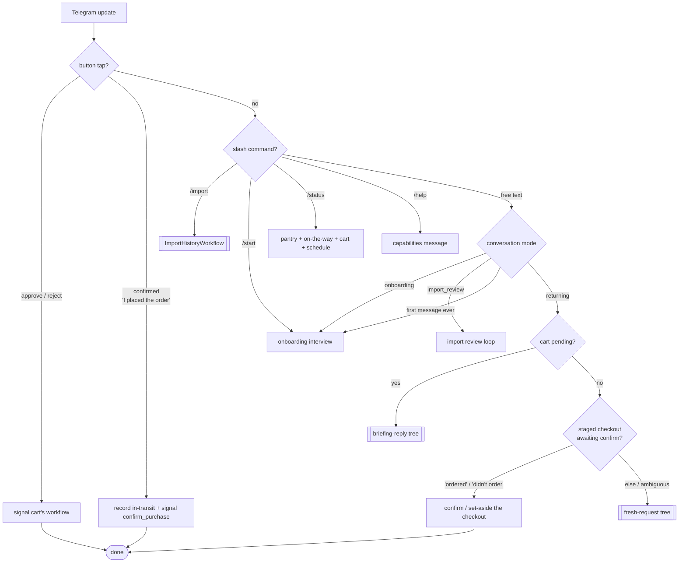
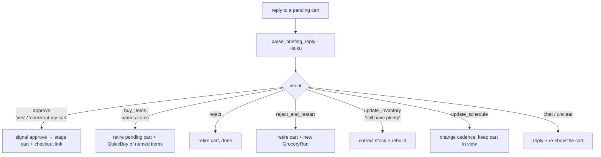
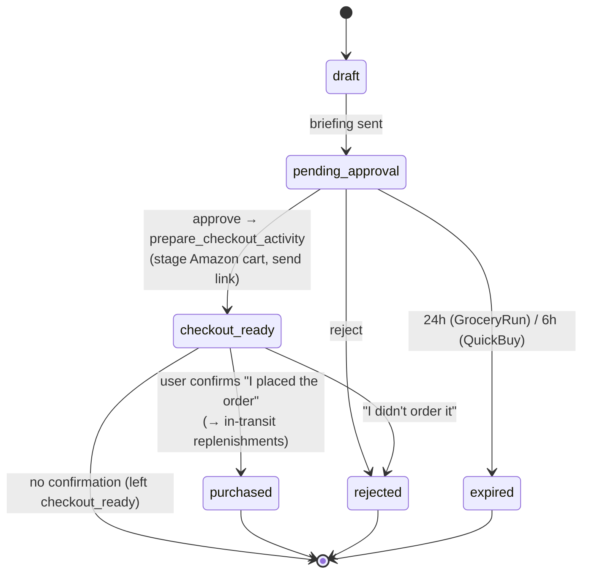
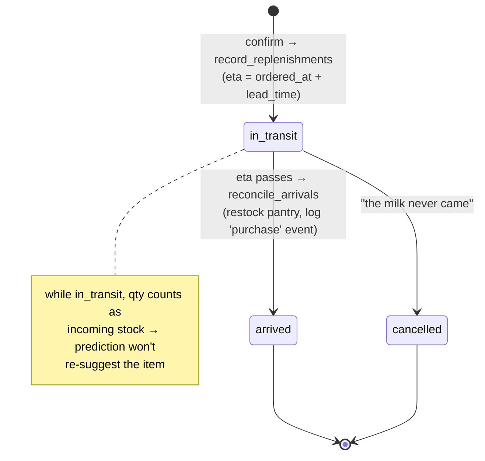
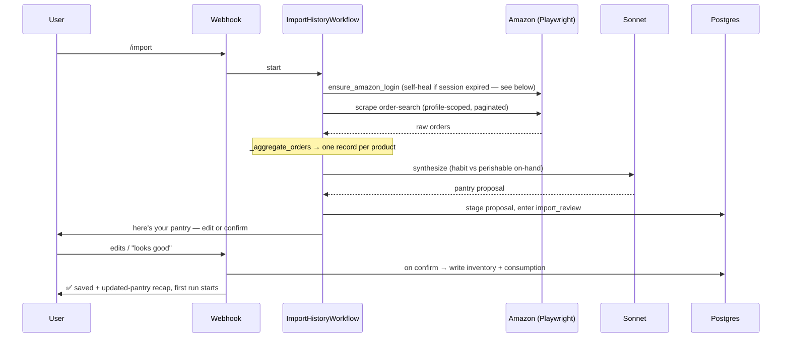
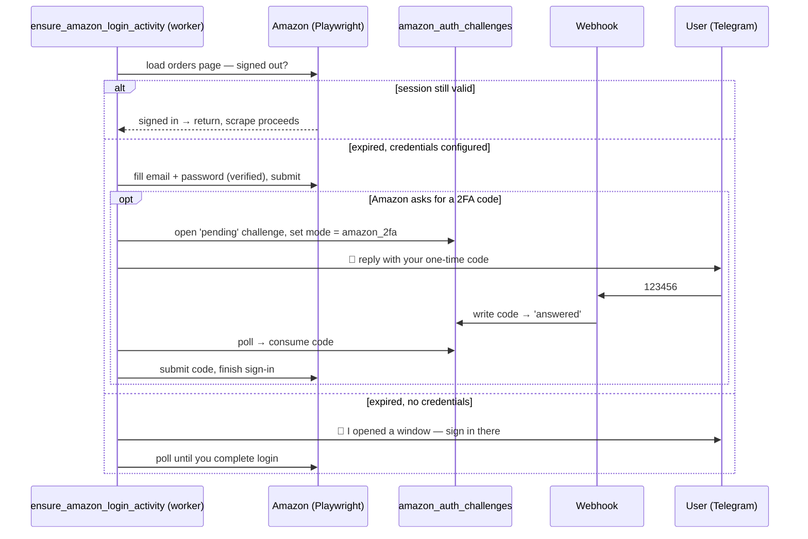

# System Reference

The canonical map of grocery-buddy: every model, agentic loop, deterministic
workflow, tool, data model, and decision tree, and how they fit together. If you
change behavior, update this file.

> Companion docs: [ARCHITECTURE.md](ARCHITECTURE.md) (why the stack is shaped this
> way), [DATABASE.md](DATABASE.md) (schema detail), [OPERATIONS.md](OPERATIONS.md),
> [SETUP.md](SETUP.md), [HOSTING.md](HOSTING.md),
> [FEATURES_AND_ROADMAP.md](FEATURES_AND_ROADMAP.md) (what's next),
> [PROCUREMENT_CONVERGENCE.md](PROCUREMENT_CONVERGENCE.md) (the merge decision),
> [EVALS.md](EVALS.md) (how we measure prediction accuracy, LLM-output quality, and
> per-run cost — and how those gate money-live).

---

## 1. Mental model

Two kinds of "brains" run the product, and they are deliberately separated:

| | **Agentic loops** (Claude) | **Deterministic workflows** (Temporal) |
|---|---|---|
| Owns | language → intent, synthesis, conversation | scheduling, retries, the approval timer, exactly-once money movement |
| Lives in | `agents/*.py`, one activity in `activities.py` | `workflows/*.py` |
| Failure mode | degrade to a fallback message / empty result | durable retry, survives crashes |
| When unsure | ask the user / default safely | never guess — replay deterministically |

The flow of control is always: **Telegram message → webhook decision tree → (Claude
loop to read intent) → start a Temporal workflow → (Temporal calls activities, some
of which call Claude) → notification back to Telegram.**

Two safety invariants hold everywhere:

1. **We never place an order.** The agent stages an Amazon cart and hands back a
   checkout link; the human taps "Place order." (The agent then *remembers* a
   confirmed order — tracking it as in-transit and topping up the pantry on arrival —
   but it still never spends money itself.)
2. **Nothing touches the live pantry or a cart without the user's say-so** — every
   purchase passes an approval gate, the order-history import stages a proposal the
   user confirms before it's written, and the pantry only auto-tops-up *after* the
   user confirms they placed the order.

The pantry is a single picture of **on-hand + on-the-way**: once you confirm an order,
its items are counted as covered stock so the agent won't re-suggest them, and they
convert to on-hand when their estimated delivery date passes (§7, §4.1).

---

## Visual map

### Components — who talks to whom


### Inbound message routing (the top-level decision tree)


### Reply when a cart is pending (least-friction rule)


### Cart approval lifecycle (GroceryRun / QuickBuy)


### In-transit replenishment lifecycle (after "I placed the order")


### Order-history import pipeline (`/import`)


### Self-healing Amazon re-login + 2FA relay (`ensure_amazon_login_activity`)
When the saved browser session has expired, the import re-authenticates on its own
instead of dead-ending. With `AMAZON_EMAIL`/`AMAZON_PASSWORD` set it fills the form
fully unattended (a verified, state-machine fill — see §10); without them it opens a
visible window for a one-time manual sign-in. A 2FA prompt is relayed to the user
over Telegram and back through the `amazon_auth_challenges` table.


---

## 2. Models (Claude)

Configured in `config.py`; two tiers.

| Setting | Default | Used for |
|---|---|---|
| `model_smart` | `claude-sonnet-4-6` | **Only** order-history synthesis (`synthesize_grocery_history`) — the one genuinely hard parse/reasoning step |
| `model_fast` | `claude-haiku-4-5` | Everything else: onboarding intake, import review, request parsing, briefing-reply parsing, briefing composition, brand selection |

Rule of thumb: Haiku for routing/extraction/chat; Sonnet only where messy
real-world data must become a clean structured proposal.

**Every call goes through `grocery_buddy.llm`** — the single Anthropic entry point.
`create_message(...)` uses one process-wide shared `AsyncAnthropic` client (keeps
httpx's connection pool), and `record_usage()` prices the response, feeds the Langfuse
trace, and (fire-and-forget) writes a row to the `llm_usage` cost ledger. Helpers:
`cacheable_system` / `with_transcript_cache` add prompt-cache breakpoints respecting
Haiku's 4096-token cacheable floor (they pay off on the onboarding/import loops and
no-op elsewhere); `run_scope(workflow_id, user_id)` tags every call made inside a
Temporal run so `evals.sum_run_cost(workflow_id)` can total a run's spend. Never call
the Anthropic SDK directly and never hardcode a model id.

---

## 3. Agentic loops (Claude tool-use)

Six distinct LLM call-sites. "Loop" = re-prompts until no more tool calls;
"single-shot" = one call.

> **Shared voice:** the conversational prompts (3.3–3.6) all prefix a single
> `PERSONA` constant (`agents/assistant.py`) — "warm, concise Grocery Buddy; never
> interrogate for a qty/brand they didn't give; Telegram HTML only." Edit the voice
> in one place; don't restate those rules per prompt.

### 3.1 Onboarding intake — `agents/onboarding.py::advance_onboarding` *(loop, Haiku)*
Parses a free-form pantry dump ("12 eggs, milk weekly, paper towels") into saved
records. Loops on tool results until the turn is done.
Tools: `save_inventory_item`, `save_consumption_habit`, `import_amazon_orders`
(hands off to the import flow), `finish_onboarding`.
Writes directly to `inventory_items` / `consumption_profile`.

### 3.2 Import synthesis — `agents/order_history.py::synthesize_grocery_history` *(single-shot, Sonnet, `max_tokens=8192`)*
Turns scraped Amazon orders into a clean, de-duplicated recurring-pantry proposal.
Forced tool call: `propose_pantry`. Never raises — degrades to `[]`.

**Pre-aggregation (`_aggregate_orders`, pure Python) runs first:** raw orders are
collapsed into **one record per product** keyed by ASIN (title fallback), carrying
`times_ordered`, `total_units`, `first/last_ordered`, `days_since_last`, and recent
`order_dates`. This is essential, not cosmetic — sending 150 raw rows made the
forced tool call overflow `max_tokens` and return unparseable/empty results. The
model then makes **two separate judgments per product**:
1. *Include?* — repeat-staple vs one-off (keep groceries/consumables; drop clothing,
   bedding, electronics, one-time buys).
2. *Habit vs on-hand* — always learn the **habit** (`daily_rate`, `preferred_brand`,
   `unit`) even from old orders, but estimate **on-hand today** realistically:
   perishables past shelf life → `estimated_qty = 0` (nobody has 3-month-old milk);
   non-perishables deplete from the last order by rate × `days_since_last`. So a
   stale milk order teaches "drinks ~X of 2% [brand]/week" while contributing 0 to
   current stock — the first post-import run then suggests restocking it.
`stop_reason` and item counts are logged so a truncated/empty proposal is never
silent again.

### 3.3 Import review — `agents/order_history.py::advance_import_review` *(loop, Haiku)*
Conversational edit of the staged proposal before it's saved.
Tools: `remove_items`, `update_item`, `add_item`, `confirm_import`, `cancel_import`.
Edits persist to `import_proposals` as they happen; the live pantry is written only
on `confirm_import` (by `_finalize_import` in the webhook).

### 3.4 Fresh-request parsing — `agents/assistant.py::parse_request` *(single-shot, Haiku)*
Interprets a message when **no cart is pending**. Receives a pantry snapshot so it
can answer stock questions and route "buy everything low."
Tools → returned action:
`request_purchase`→`quick_buy` · `restock_low_items`→`start_grocery_run` ·
`update_pantry_quantity`→`update_inventory` · `update_schedule` · else `chat`.

### 3.5 Briefing-reply parsing — `agents/assistant.py::parse_briefing_reply` *(single-shot, Haiku)*
Interprets a message when **a cart is pending** (see decision tree §6.3).
Tools → action: `approve_cart`→`approve` · `buy_items`→`buy_items` ·
`reject_cart`→`reject` · `reject_and_restart` · `update_pantry_quantity`→`update_inventory` ·
`update_schedule` · else `chat`.

### 3.6 Briefing composition — `agents/assistant.py::compose_briefing` *(single-shot, Haiku)*
Writes the warm approval message, grounded on exact item names/prices so it can't
drift. Falls back to a deterministic render if the model drops the total.

**Plus one in-activity call:** `_select_candidate_by_brand` (`activities.py`, Haiku)
picks the best Amazon listing for a brand preference; short-circuits to "cheapest"
with no LLM call when there's no preference or a single candidate.

---

## 4. Deterministic workflows (Temporal)

Registered in `workflows/worker.py` on task queue `grocery-buddy`. All three share
the `approve`/`reject` signals and the `notify_activity` reporter. GroceryRun and
QuickBuy additionally share the post-checkout `confirm_purchase`/`mark_not_purchased`
signals (the in-transit loop, below).

### 4.1 `GroceryRunWorkflow` — scheduled/manual restock
Trigger: Temporal Schedule (cron) or manual start. `trigger ∈ {schedule, manual, onboarding}`.

```
reconcile_arrivals_activity        → land any in-transit order whose ETA passed
                                     (restock pantry) BEFORE predicting (idempotent)
apply_estimated_depletion_activity → decay on-hand estimates since last reconcile
load_user_data                     → inventory, profiles, events, prefs, INCOMING + guardrails
  └─ guardrails (scheduled runs only): skip if a cart is already pending_approval;
     skip if another run happened within run_cooldown_minutes
select_run_candidates_activity     → must-buy (predictor §7) + fillers (soonest-due
                                     mediums) to clear free shipping
  └─ prediction adds INCOMING (in-transit qty) to on-hand, so a just-ordered item
     is not re-suggested while on the way
  └─ no must-buy → notify "well stocked", end  (never runs on fillers alone)
lookup_amazon_prices               → Playwright search + brand-aware selection
assemble_run_cart_activity         → keep every must-buy; add fillers only until the
                                     free-shipping threshold is cleared; ``reason`` text
build_draft_cart                   → carts + cart_items rows, stamps workflow_id
send_approval_notification         → Telegram briefing (compose_briefing)
update_cart_status → pending_approval
wait_condition(decision, timeout = 24h)     ◄── approve/reject signal from webhook
  ├─ approved → update_cart_status(approved) → prepare_checkout_activity (stage Amazon
  │             cart, send checkout link + "I placed the order" button, NO_RETRY)
  │             → run_evals_activity → _await_purchase_confirmation (in-transit loop ▼)
  └─ rejected/expired → update_cart_status → run_evals_activity, done

_await_purchase_confirmation:  (the in-transit loop — closes the post-checkout gap)
  wait_condition(purchase_decision, timeout = purchase_confirm_wait_hours/72h)
    ◄── confirm_purchase / mark_not_purchased signal from webhook
  ├─ confirmed     → record_replenishments_activity (cart lines → in-transit,
  │                  eta = ordered_at + lead_time) → workflow.sleep(until eta)
  │                  → reconcile_arrivals_activity (restock + "it arrived" nudge)
  ├─ not_purchased → update_cart_status(rejected)
  └─ timeout       → leave checkout_ready (never assume an order happened)
```
Note: **still no auto-purchase** — the human taps "Place order" on Amazon. What the
in-transit loop adds is *memory* of a confirmed order: it tracks the delivery and
tops up the pantry on arrival, so the agent doesn't re-suggest eggs it already bought.
The `confirm_purchase` signal is best-effort/elegant; the webhook writes the in-transit
rows synchronously on the tap, and the run-start `reconcile_arrivals_activity` is the
safety net that lands arrivals even if a worker missed the durable timer. A top-level
`try/except` notifies the user on any unexpected failure so a run never ends in silence.

### 4.2 `QuickBuyWorkflow` — ad-hoc "buy X now"
Trigger: `quick_buy` / `buy_items` actions. No guardrails (ad-hoc is never
cooldown-blocked). Same shape as GroceryRun but skips prediction (items are given)
and uses a **6h** approval timeout (ad-hoc requests are time-sensitive). It runs the
**same in-transit confirmation loop** after checkout — crucial because "I need eggs
early" is exactly the case that must not be re-suggested by the next scheduled run.

```
load_user_data (for brand prefs) → lookup_amazon_prices → build_draft_cart
→ send_approval_notification → wait_condition(6h)
   ├─ approved → prepare_checkout_activity → checkout link
   │             → _await_purchase_confirmation (in-transit loop, §4.1)
   └─ rejected/expired → done
```

### 4.3 `ImportHistoryWorkflow` — bootstrap pantry from Amazon orders
Trigger: `/import`, or `import_amazon_orders` during onboarding.

```
ensure_amazon_login_activity       → self-heal the session if expired (§10); raises a
                                     non-retryable login-required error if it can't
scrape_amazon_orders_activity      → Playwright scrape of order-search listing
  └─ none → notify "set up the quick way", end
synthesize_pantry_from_orders_activity   → Sonnet proposal (§3.2)
  └─ none → notify, end
present_import_proposal_activity   → stage proposal, switch conv to import_review,
                                     send the proposal to Telegram
```
The workflow ends here. The user then edits/confirms conversationally (§3.3, §6.4);
on confirm the webhook writes the pantry.

### 4.4 Activity catalog (`workflows/activities.py`)
All I/O lives here; workflows stay pure.

| Activity | Does |
|---|---|
| `notify_activity` | Send a plain Telegram message (no-op/skip/failure reporting) |
| `reconcile_arrivals_activity` | Land in-transit orders past their ETA: restock pantry + log `purchase` events + "it arrived" nudge (idempotent) |
| `record_replenishments_activity` | Record a confirmed cart's lines as in-transit (eta = ordered_at + lead_time); idempotent per cart |
| `apply_estimated_depletion_activity` | Decay on-hand estimates by assumed use since last reconcile |
| `load_user_data` | Load inventory, profiles, events, prefs, **incoming** (in-transit) map + guardrail signals |
| `predict_low_items_activity` | Run the rule-based predictor → low items |
| `select_run_candidates_activity` | Split into must-buy (low now) + fillers (soonest-due mediums) to clear free shipping; returns `threshold_usd`, `max_fillers`. Also writes a `prediction_snapshots` row (what the predictor decided) for the accuracy eval |
| `lookup_amazon_prices` | Playwright search + brand-aware candidate selection (Haiku) |
| `lookup_kroger_prices` | Kroger public Products API (price comparison; inert without a token) |
| `assemble_run_cart_activity` | Trim priced candidates → final cart: every must-buy + only enough fillers to clear free shipping; returns `reason` |
| `build_draft_cart` | Write `carts` + `cart_items`, stamp `workflow_id` |
| `send_approval_notification` | Compose + send the briefing for approval |
| `update_cart_status` | Flip cart status |
| `prepare_checkout_activity` | Clear the existing cart, then stage by ASIN, mark `checkout_ready`, return checkout link (clear-first prevents cross-run accumulation; idempotent on `idempotency_key`; never purchases) |
| `send_checkout_link_activity` | (Re)send a checkout link |
| `run_evals_activity` | Prediction precision/recall from `prediction_snapshots` → Langfuse; cost alert from the run's summed `llm_usage` (see EVALS.md) |
| `ensure_amazon_login_activity` | Self-heal the Amazon session (credential fill or interactive window) + relay 2FA over Telegram; non-retryable login-required error on failure (§10) |
| `scrape_amazon_orders_activity` | Scrape order history (profile-scoped search) |
| `synthesize_pantry_from_orders_activity` | Sonnet synthesis wrapper |
| `present_import_proposal_activity` | Stage proposal + enter review mode + send it |

All 20 activities live here; the workflows themselves stay pure (no I/O).

---

## 5. Tools (three senses)

### 5.1 Claude tool schemas (per agent)
See §3 — these are the `tools=[...]` handed to each Claude call. They are the
"verbs" the model can choose.

### 5.2 Data-access modules (`tools/*.py`) — plain async functions, shared by activities, agents, MCP
| Module | Functions |
|---|---|
| `tools/inventory.py` | `get_inventory`, `upsert_inventory_item`, `set_actual_quantity`, `log_consumption_event` |
| `tools/consumption.py` | `get_consumption_profile`, `upsert_consumption_profile`, `get_recent_consumption_events` |
| `tools/conversation.py` | `get_conversation`, `set_conversation`, `clear_conversation`, `is_first_time` |
| `tools/imports.py` | `create_import_proposal`, `get_active_import_proposal`, `update_proposal_items`, `set_proposal_status`, `apply_edits` (pure) |
| `tools/schedule.py` | `upsert_schedule`, `get_schedule`, `next_run_utc`, `describe_next_run`, `describe_cadence` |
| `tools/auth.py` | 2FA relay mailbox: `create_otp_challenge`, `submit_otp_code`, `read_answered_code`, `expire_challenge` (backs the `amazon_auth_challenges` table, §10) |
| `tools/predictions.py` | `record_prediction_snapshot`, `get_recent_snapshots` (writes/reads `prediction_snapshots`, backing the accuracy eval) |
| `tools/reset.py` | `clear_user_data` (the `/clear` testing reset) |

### 5.3 MCP server tools (`mcp_server.py`) — FastMCP, for local dev with Claude Code
`list_inventory`, `set_inventory_item`, `record_consumption`,
`correct_inventory_quantity`, `list_consumption_habits`, `set_consumption_habit`,
`list_consumption_events`. These wrap the §5.2 modules.

---

## 6. Decision trees

### 6.1 Inbound Telegram routing — `webhook.py::telegram`
```
message
├─ callback button (approve/reject)         → signal the cart's workflow
├─ callback button (confirmed)              → record in-transit + signal confirm_purchase
├─ /clear                                    → wipe pantry+habits (hidden)
├─ /start | /restart | /onboard              → reset + start onboarding
├─ /import | /importorders                   → start ImportHistoryWorkflow
├─ /status                                    → pantry + on-the-way + pending cart + schedule
├─ /help                                      → capabilities message (leads with /import)
└─ free text → look up conversation mode:
     ├─ mode == onboarding     → advance_onboarding turn
     ├─ mode == import_review  → advance_import_review turn (§6.4)
     ├─ first message ever     → start onboarding
     └─ returning user:
          ├─ pending cart exists           → briefing-reply tree (§6.3)
          ├─ staged checkout awaiting confirm AND reply clearly confirms/denies
          │                                 → confirm (record in-transit) / set aside
          └─ else                          → fresh-request tree (§6.2)
```
The awaiting-confirmation check uses a **tight keyword classifier**
(`_classify_checkout_followup`) so an outstanding checkout only swallows a reply that
clearly says "ordered" / "didn't order" — anything ambiguous ("we're out of milk")
falls through to normal handling.

### 6.2 Fresh request (no pending cart) — `_handle_fresh_request`
Builds a pantry snapshot, calls `parse_request`, then:
```
quick_buy          → start QuickBuyWorkflow with named items
start_grocery_run  → start GroceryRunWorkflow (trigger=manual)   ← "buy all I'm low on"
update_inventory   → correct on-hand quantities
report_not_arrived → cancel in-transit rows for named items   ← "the milk never came"
update_schedule    → upsert the cron schedule
chat               → reply (can answer "what am I low on?" from the snapshot)
```

### 6.3 Briefing reply (cart pending) — `_handle_briefing_reply`
**Guiding rule (least friction): naming items = a brand-new cart; only an explicit
approval checks out the pending suggestion.**
```
approve            → signal approve  (checkout the pending cart)
buy_items          → retire pending cart + start QuickBuy of the named items
                     (empty list → ask which items, keep cart in view)  ← "buy milk and eggs"
reject             → retire pending cart (done, nothing bought)
reject_and_restart → retire pending cart + start a fresh GroceryRun (rebuild suggestion)
update_inventory   → correct stock; if nothing landed, ask + keep cart; else retire + rebuild
update_schedule    → upsert schedule, then re-show the cart (still actionable)
chat               → reply + re-show the pending cart
```
This is the behavior the user asked for: `"buy x and y"` → fresh cart;
`"checkout my pending cart"` → approve. **"Retire" = signal reject AND flip the cart's
DB status synchronously** (`_retire_pending_cart`) so the replacement run/cart never
races the old workflow's status update (no double-pending carts, no silent no-op from
the open-cart guard).

### 6.4 Import review (mode == import_review) — `_handle_import_review_turn`
```
advance_import_review (Haiku loop, edits persist to import_proposals)
├─ outcome == confirm → _finalize_import: write inventory + consumption,
│                       send "updated pantry" recap, start first GroceryRun
├─ outcome == cancel  → discard proposal, clear mode
└─ outcome == continue→ send reply, stay in import_review
```

### 6.5 GroceryRun guardrails (scheduled runs only)
```
trigger == schedule and (cart already pending_approval)      → skip
trigger == schedule and (a run happened < run_cooldown_minutes ago) → skip
manual / onboarding triggers bypass both guardrails (always run, always report)
```

---

## 7. Prediction & stock (rule-based, no LLM) — `predictor.py`, `stock.py`, `depletion.py`, `replenishment.py`
- `predict_low_items`: `days_left = (qty + incoming) / effective_daily_rate`; flag
  items where `days_left ≤ lead_time + buffer`. `effective_daily_rate` blends the
  declared habit (prior) with observed consumption events (posterior, capped weight).
  **`incoming`** is the in-transit qty (confirmed-but-not-arrived orders) — added to
  on-hand so a just-ordered item isn't re-flagged while on the way.
- `classify_stock_levels` / `summarize_stock`: bucket every item into LOW / MEDIUM /
  LARGE (also incoming-aware) — powers `/status` and the assistant's pantry snapshot.
- `apply_estimated_depletion`: advances on-hand estimates between runs so prediction
  sees fresh numbers; idempotent (only advances items it decrements).
- `replenishment.py` (the in-transit half of the pantry): `record_replenishments`
  (confirm → in-transit rows), `get_incoming_by_product` (the prediction input),
  `reconcile_arrivals` (eta passed → restock, idempotent), `cancel_in_transit`
  ("never came"), `eta_for` (pure shipping-time math). See §4.1 and DATABASE.md
  `pending_replenishments`.

---

## 8. Data models & tables

### 8.1 Dataclasses — `models.py`
- **DB row mirrors:** `InventoryItem`, `ConsumptionProfile`, `ConsumptionEvent`,
  `Cart`, `CartItem`, `UserPreferences`
- **Workflow I/O (JSON-serializable):** `GroceryRunInput`, `QuickBuyInput` /
  `QuickBuyItem`, `ImportHistoryInput`, `LookupInput` / `LowItem`, `BuildCartInput`,
  `NotificationInput`, `PurchaseInput`, `UpdateCartInput`, `PricedItem`, `DraftCart`,
  `GroceryRunResult`

### 8.2 Postgres tables (migrations) — see [DATABASE.md](DATABASE.md)
`users`, `inventory_items`, `consumption_profile`, `consumption_events`,
`pending_replenishments`, `preferences`, `carts`, `cart_items`, `purchases`,
`approvals`, `price_snapshots`, `schedules`, `amazon_profiles`, `conversation_state`,
`import_proposals`, `amazon_auth_challenges`, `prediction_snapshots` (predictor-decision
log for the accuracy eval), `llm_usage` (per-call cost ledger) — 18 tables, migrations
`001`–`011`.

Conversation modes (`conversation_state.mode`): `idle`, `onboarding`,
`import_review`, `amazon_2fa` (set while relaying a one-time code, §10).
Cart statuses: `draft → pending_approval → checkout_ready → {purchased | rejected}`,
plus `{rejected | expired | failed}` from earlier states.
In-transit statuses (`pending_replenishments.status`): `in_transit → {arrived | cancelled}`.

---

## 9. Notifications & entry points
- **Outbound** (`notifications.py`, Telegram): `send_telegram_message`,
  `send_briefing` (approval push w/ inline buttons), `send_checkout_link` (checkout
  link + "I placed the order" confirm button), `send_arrival_notification`
  ("order landed — pantry topped up").
- **Inbound:** `webhook.py` `/telegram` (messages + button callbacks: approve / reject
  / confirmed), `/health`.
- **CLI** (`cli.py`): `onboard`, `worker`, `run`, `webhook`, `schedule`, `evals`,
  `mcp`, `ask` (drives `parse_request` from the terminal), `scraper-health` (run the
  synthetic Amazon-selector probe, §11), `gate --user-id` (print the money-live
  readiness gate, see EVALS.md).
- **Scripts:** `scripts/setup_amazon_session.py` (save a login interactively),
  `scripts/debug_order_scrape.py` (run just the order scrape and print JSON),
  `scripts/seed_user.py` (create a user + preferences row).

---

## 10. Self-healing Amazon login (`automation/amazon_auth.py`, `tools/auth.py`)

Amazon has no consumer ordering API, so the agent drives a persistent authenticated
Playwright profile (`.amazon-session/`). When that session expires,
`ensure_amazon_login_activity` re-authenticates **before** any scrape — no terminal
command needed. Diagram in the Visual map above.

**Two entry points (`amazon_auth.py`):**
- `login_with_credentials(...)` — unattended. Drives the sign-in form as a **bounded
  state machine**: each pass detects the live step (email / password / 2FA / passkey
  chooser / upsell / profile gate) and acts, re-checking after every transition
  (Amazon sequences these differently across A/B variants). Every field write is
  **verified** — it reads the value back and retries, typing character-by-character if
  a programmatic fill doesn't stick (Amazon's JS sometimes clears an autofilled field).
  Bails on a clear rejection rather than resubmitting a bad password in a loop.
- `wait_for_interactive_login(...)` — used when no credentials are configured: opens a
  visible window and polls the signed-in state without touching the page the user types into.

**Orchestration (`ensure_amazon_login_activity`):** probe the session headlessly →
if valid, return; else if `AMAZON_EMAIL`/`AMAZON_PASSWORD` are set, fill them; on
failure, fall through to a visible window when one can be shown (local/dev) or raise
`AMAZON_LOGIN_REQUIRED` (non-retryable) on a headless host.

**2FA relay (the cross-process channel):** the worker holds the browser open on the
OTP page but can't read the user's authenticator. `tools/auth.py` uses the
`amazon_auth_challenges` table as a mailbox — the activity opens a `pending` challenge
and asks for the code over Telegram (switching the user to the `amazon_2fa`
conversation mode); the webhook writes the reply (`submit_otp_code` → `answered`); the
activity polls and consumes it (`read_answered_code` → `consumed`) and submits it to
Amazon. `harden_page` installs a virtual WebAuthn authenticator first so Amazon's
passkey prompt falls back to the password+code flow we can actually drive.

**Relevant config** (`config.py`): `amazon_email`, `amazon_password`,
`amazon_profile_name`, `amazon_headless`, `amazon_login_wait_seconds`.

---

## 11. Automation resilience & money-live gate

Amazon pins the automation to its internal CSS ids; a redesign breaks them **silently**
(a renamed class returns `[]`, swallowed at `logger.warning`), so pricing/import quietly
under-deliver. Three layers turn that silent failure into a fast deterministic path, a
self-healing fallback, and an alert.

**`automation/resilience.py` — self-healing, observable element resolution.**
- `Strategy` descriptors (`css` / `role` / `text` / `label` …) + `build_locator` let one
  intent carry a chain of CSS ids **and** role/ARIA fallbacks (accessible names churn far
  less than ids). `first_matching` tries the chain and returns the first hit — the
  deterministic fast path.
- `resolve(intent, ...)` is `first_matching` for a *critical* intent, instrumented:
  hit/miss is recorded to the run's `SelectorHealthReport`, and on a **total 0-match** it
  falls back to LLM **repair** — asks a model (`selector_repair_model`, default Sonnet)
  over the page's accessibility tree (vision only if `selector_repair_vision`) which
  element matches, validates the answer, **caches** the rediscovered descriptor
  (`selector_cache_path`), and uses it. Repair runs **only** on a 0-match, so the hot path
  stays deterministic. `summarize_health` flags a critical 0-match and emits Langfuse
  scores. Repair never runs on the add-to-cart click — reads only.

**`automation/network.py` — interception over scraping.**
- `block_heavy_resources` aborts images/media/fonts + ad/telemetry beacons (Amazon pages
  never go idle otherwise). Applied to **read paths only** (search, order scrape) — never
  sign-in or add-to-cart, where a blocked captcha image or suppressed telemetry could
  break auth or look bot-like on the money path.
- `confirm_add_to_cart` treats Amazon's own cart-mutation XHR (JSON) as the success
  signal, far more stable than waiting on one of seven overlay CSS ids.
- `JsonResponseCollector` opportunistically captures JSON XHR bodies — a hedge/diagnostic
  for if/when the server-rendered pages move to client-rendered JSON.

**`monitoring.py` — synthetic scraper health.** `check_scraper_health()` searches known
staples and asserts a price + ASIN still extract; on regression it pages the user so
churn surfaces on first break, not after a week of empty runs. Run via
`grocery-buddy scraper-health` (cron / Temporal schedule / ad-hoc). It is also a
precondition of the money-live gate.

**`gating.py` — money-live readiness gate.** `money_live_ready(user_id)` is the hard stop
for any future auto-buy path: it only returns `ready=True` when every condition passes —
both flags on (`auto_buy_enabled` **and** `money_live`), predictor precision ≥
`gate_predictor_precision_floor`, run cost ≤ `gate_run_cost_ceiling_usd`, scraper green,
and `checkout_verified` (a deliberate hard stop until staged-cart execution is verified).
Inspect it with `grocery-buddy gate --user-id <id>`. The conditions are outputs of the
eval layer — see **[EVALS.md](EVALS.md)**.

**Relevant config** (`config.py`): `amazon_block_heavy_resources`, `selector_cache_path`,
`selector_repair_enabled`, `selector_repair_vision`, `selector_repair_model`,
`selector_health_alerts`; `auto_buy_enabled`, `money_live`,
`gate_predictor_precision_floor`, `gate_run_cost_ceiling_usd`,
`cost_alert_threshold_usd`, `eval_lookback_days`, `eval_horizon_days`.
